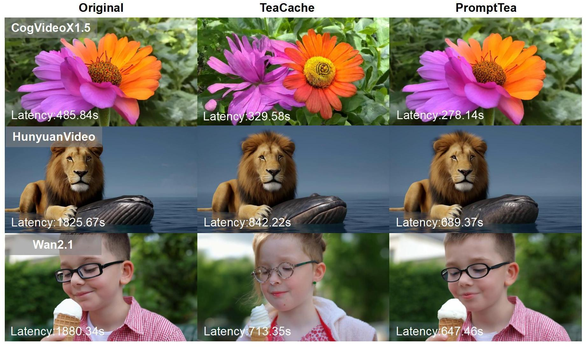

# PromptTea: Let Prompts Tell TeaCache the Optimal Threshold

[](http://arxiv.org/abs/2507.06739) 



## 🫖 Introduction 
This repository contains the official implementation of our paper: PromptTea: Let Prompts Tell TeaCache the Optimal Threshold

## 🔥 Latest News
🔔 **[Latest News](#latest-news)**  
- If you like our project, please give us a star ⭐ on GitHub for the latest update.  
- **[2025/07/10]** 🎉 Submitted to arXiv for review.  
- **[2025/07/10]** 🔥 Released open-source code of PromptTea. Support [CogVideoX1.5](https://github.com/THUDM/CogVideo), [HunyuanVideo](https://github.com/Tencent/HunyuanVideo) and [Wan2.1](https://github.com/Wan-Video/Wan2.1).  

## 🎉 Supported Models 
**Text to Video**
- [PromptTea4CogVideoX1.5](./PromptTea4CogVideoX1.5/README.md)
- [PromptTea4HunyuanVideo](./PromptTea4HunyuanVideo/README.md)
- [PromptTea4Wan2.1](./PromptTea4Wan2.1/README.md)


## 💐 Acknowledgement 

This repository is built based on [TeaCache](https://github.com/ali-vilab/TeaCache/tree/main), [FasterCache](https://github.com/Vchitect/FasterCache), [Diffusers](https://github.com/huggingface/diffusers), [CogVideoX](https://github.com/THUDM/CogVideo), [HunyuanVideo](https://github.com/Tencent/HunyuanVideo) and [Wan2.1](https://github.com/Wan-Video/Wan2.1). Thanks for their contributions!

## 📚 Citation

```bibtex
@misc{huang2025prompttea,
      title={PromptTea: Let Prompts Tell TeaCache the Optimal Threshold},
      author={Zishen Huang and Chunyu Yang and Mengyuan Ren},
      year={2025},
      eprint={2507.06739},
      archivePrefix={arXiv},
      primaryClass={cs.CV},
      url={http://arxiv.org/abs/2507.06739},
}
```
## 📜 License
This project is licensed under the Apache 2.0 License.
